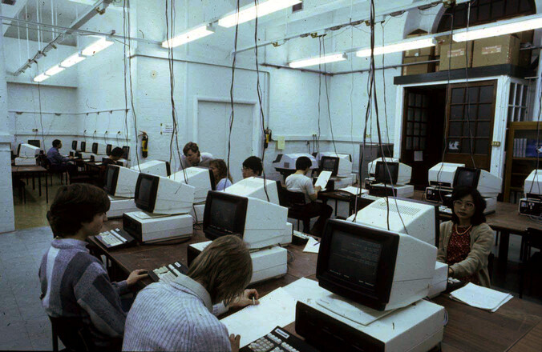
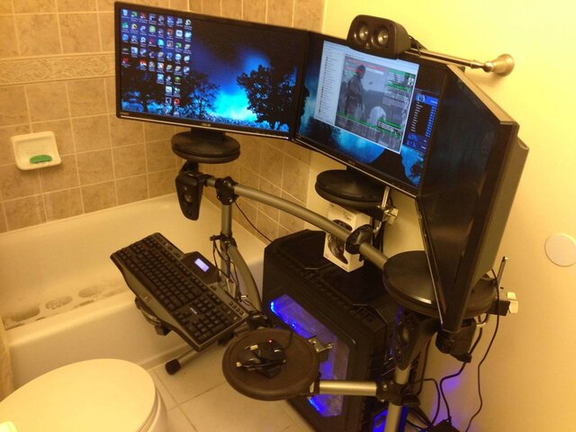

% Hacktoberfest
% Ian Shipman
% October 2020

# Open Source Chicago

## Vist our repository

[https://github.com/OpenSourceChi/hacktoberfest](https://github.com/OpenSourceChi/hacktoberfest)

# Working on OSS

---

## Git

::: incremental

* You need to know how to use `git` for automatic version management
* Resources at [https://try.github.io](https://try.github.io)
* Ask your new friends here for help!

:::

## Contributing patches

## Before you start

> Find the project community on IRC or Gitter or wherever, and say hi!

## On your own system ...

---

## Workflow

::: incremental

* `git clone` -- create a local copy
* Make some changes
* `git commit` -- commit the changes with a descriptive message 

:::

## On Github ...

## Workflow

::: incremental

* Use Github's fork tool to fork the repository
* `git remote add` -- add the fork to your local repository
* `git push` -- push your commits to your fork
* Open a pull request

:::

## Contributing review

> Just make comments on issues and pull requests! Thoughtful review is valuable and dramatically undersupplied.

## Other ways to contribute

::: incremental

* Promote projects that you think are cool
* If you have disposable income, support project developers
* Use OSS and report bugs

:::

## Maintaining a project

## Things maintainers do

::: incremental

* Organize issues and manage their state
* Evaluate pull requests and help get them in good shape to merge
* Keep the project developing according to a coherent vision

:::

## How to find work

## Write down bugs

Investigate bugs in the software you use every day and fix them.

## Software crush

Look at software you think is cool and want to understand.  Study it, issues will come up.

## Ask the maintainer

If the project is small, check with the maintainer if they want help on any particular issue

# Etiquette

## Be polite

You can build a reputation as being easy to work with 

## Defer to maintainers

We submit individual changes but maintainers have to integrate work across the project

## Avoid spamming

* Fine most of the time: Whitespace + deeply buried spelling mistakes
* Avoid during Hacktoberfest

## Rebase your work as needed
## Your opinions?

Use the chat

---

Image credit: `@CompAesthetics`
